# generative-compression

TensorFlow Implementation for learned compression of images using Generative Adversarial Networks. The method was developed by Agustsson et. al. in [Generative Adversarial Networks for Extreme Learned Image Compression](https://arxiv.org/abs/1804.02958). The proposed idea is very interesting and their approach is well-described.

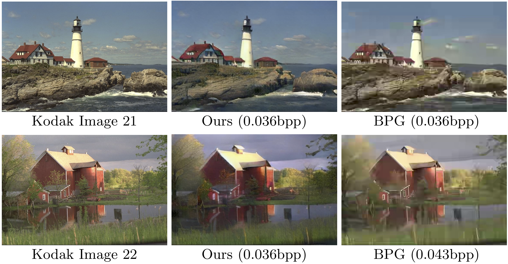

-----------------------------
## Usage
The code depends on [Tensorflow 1.8](https://github.com/tensorflow/tensorflow)
```bash
# Clone
$ git clone https://github.com/Justin-Tan/generative-compression.git
$ cd generative-compression

# To train, check command line arguments
$ python3 train.py -h
# Run
$ python3 train.py -opt momentum --name my_network
```
Training is conducted with batch size 1 and reconstructed samples / tensorboard summaries will be periodically written every certain number of steps (default is 128). Checkpoints are saved every 10 epochs. 

To compress a single image:
```bash
# Compress
$ python3 compress.py -r /path/to/model/checkpoint -i /path/to/image -o path/to/output/image
```
The compressed image will be saved as a side-by-side comparison with the original image under the path specified in `directories.samples` in `config.py`. If you are using the provided pretrained model with noise sampling, retain the hyperparameters under `config_test` in `config.py`, otherwise the parameters during test time should match the parameters set during training.

*Note:* If you're willing to pay higher bitrates in exchange for much higher perceptual quality, you may want to check out this implementation of ["High-Fidelity Generative Image Compression"](https://github.com/Justin-Tan/high-fidelity-generative-compression), which is in the same vein but operates in higher bitrate regimes. Furthermore, it is capable of working with images of arbitrary size and resolution.

## Results
These globally compressed images are from the test split of the Cityscapes `leftImg8bit` dataset. The decoder seems to hallunicate greenery in buildings, and vice-versa. 

#### Global conditional compression: Multiscale discriminator + feature-matching losses, C=8 channels - (compression to 0.072 bbp)
**Epoch 38**
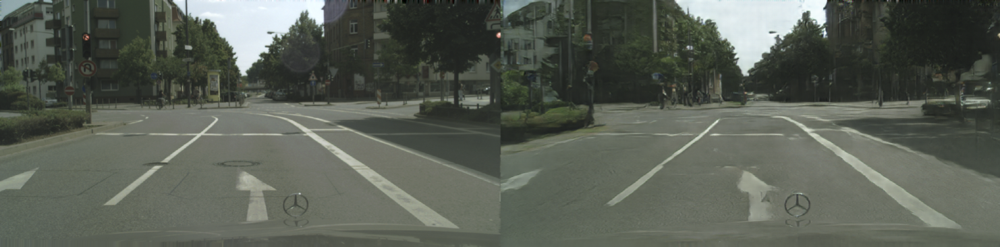
**Epoch 44**
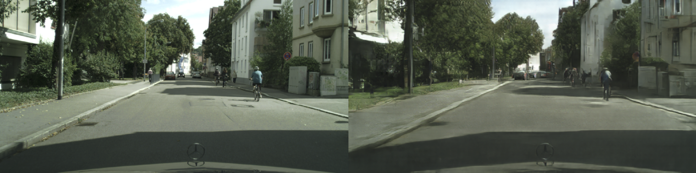
**Epoch 47**
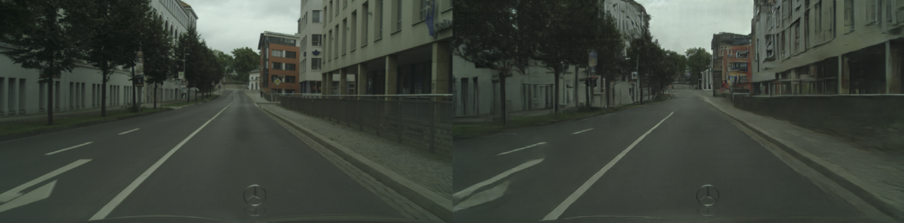
**Epoch 48**
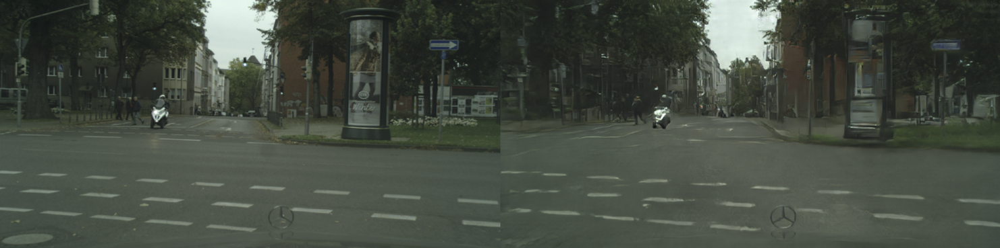
```
Show quantized C=4,8,16 channels image comparison
```
| Generator Loss | Discriminator Loss |
|-------|-------|
|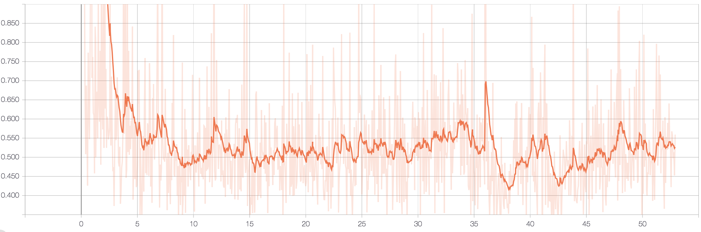 | 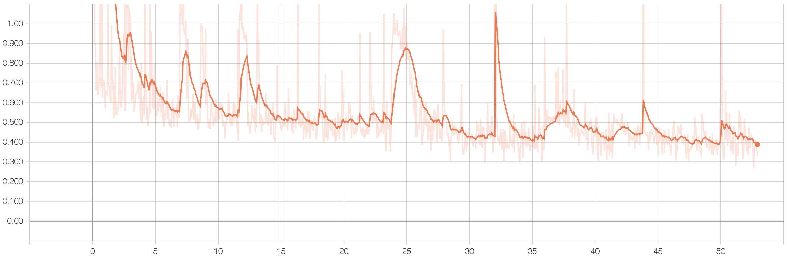 |

## Pretrained Model
You can find the pretrained model for global compression with a channel bottleneck of `C = 8` (corresponding to a 0.072 bpp representation) below. The model was subject to the multiscale discriminator and feature matching losses. Noise is sampled from a 128-dim normal distribution, passed through a DCGAN-like generator and concatenated to the quantized image representation. The model was trained for 55 epochs on the train split of the [Cityscapes](https://www.cityscapes-dataset.com/) `leftImg8bit` dataset for the images and used the `gtFine` dataset for the corresponding semantic maps. This should work with the default settings under `config_test` in `config.py`.

A pretrained model for global conditional compression with a `C=8` bottleneck is also included. This model was, trained for 50 epochs with the same losses as above. Reconstruction is conditioned on semantic label maps (see the `cGAN/` folder and 'Conditional GAN usage').

* [Noise sampling model](https://drive.google.com/open?id=1gy6NJqlxflLDI1g9Rsileva-8G1ifsEC)
* [Conditional GAN model](https://drive.google.com/open?id=1L3G4l8IQukNrsf3hjHv5xRhpNE77TD2k)

** Warning: Tensorflow 1.3 was used to train the models, but it appears to load without problems on Tensorflow 1.8. Please raise an issue if you have any problems.

## Details / extensions
The network architectures are based on the description provided in the appendix of the original paper, which is in turn based on the paper [Perceptual Losses for Real-Time Style Transfer
and Super-Resolution](https://cs.stanford.edu/people/jcjohns/eccv16/) The multiscale discriminator loss used was originally proposed in the project [High-Resolution Image Synthesis and Semantic Manipulation with Conditional GANs](https://tcwang0509.github.io/pix2pixHD/), consult `network.py` for the implementation. If you would like to add an extension you can create a new method under the `Network` class, e.g.

```python
@staticmethod
def my_generator(z, **kwargs):
    """
    Inputs:
    z: sampled noise

    Returns:
    upsampled image
    """

    return tf.random_normal([z.get_shape()[0], height, width, channels], seed=42)
```
To change hyperparameters/toggle features use the knobs in `config.py`. (Bad form maybe. but I find it easier than a 20-line `argparse` specification).

### Data / Setup
Training was done using the [ADE 20k dataset](http://groups.csail.mit.edu/vision/datasets/ADE20K/) and the [Cityscapes leftImg8bit dataset](https://www.cityscapes-dataset.com/). In the former case images are rescaled to width `512` px, and in the latter images are [resampled to `[512 x 1024]` prior to training](https://www.imagemagick.org/script/command-line-options.php#resample). An example script for resampling using `Imagemagick` is provided under `data/`. In each case, you will need to create a Pandas dataframe containing a single column: `path`, which holds the absolute/relative path to the images. This should be saved as a `HDF5` file, and you should provide the path to this under the `directories` class in `config.py`. Examples for the Cityscapes dataset are provided in the `data` directory. 

### Conditional GAN usage
The conditional GAN implementation for global compression is in the `cGAN` directory. The cGAN implementation appears to yield images with the highest image quality, but this implementation remains experimental. In this implementation generation is conditioned on the information in the semantic label map of the selected image. You will need to download the `gtFine` dataset of annotation maps and append a separate column `semantic_map_paths` to the Pandas dataframe pointing to the corresponding images from the `gtFine` dataset.

### Dependencies
* Python 3.6
* [Pandas](https://pandas.pydata.org/)
* [TensorFlow 1.8](https://github.com/tensorflow/tensorflow)

### Todo:
* Incorporate GAN noise sampling into the reconstructed image. The authors state that this step is optional and that the sampled noise is combined with the quantized representation but don't provide further details. Currently the model samples from a normal distribution and upsamples this using a DCGAN-like generator (see `network.py`) to be concatenated with the quantized image representation `w_hat`, but this appears to substantially increase the 'hallunication factor' in the reconstructed images.
* Integrate VGG loss.
* Experiment with WGAN-GP. 
* Experiment with spectral normalization/
* Experiment with different generator architectures with noise sampling. 
* Extend to selective compression using semantic maps (contributions welcome).

### Resources
* [Generative Adversarial Networks for Extreme Learned Image Compression](https://data.vision.ee.ethz.ch/aeirikur/extremecompression/#publication)
* [CycleGAN](https://arxiv.org/pdf/1703.10593.pdf)
* [High-Resolution Image Synthesis and Semantic Manipulation with Conditional GANs](https://tcwang0509.github.io/pix2pixHD/)

## More Results
#### Global compression: Noise sampling, multiscale discriminator + feature-matching losses, C=8 channels - Compression to 0.072 bbp
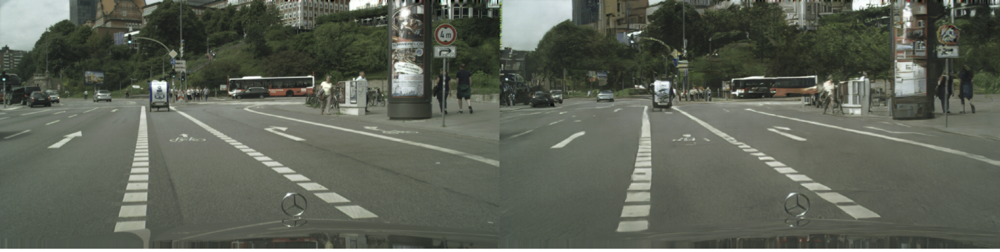
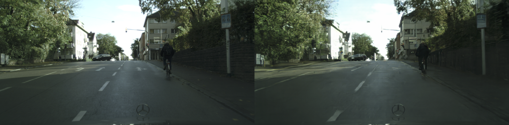
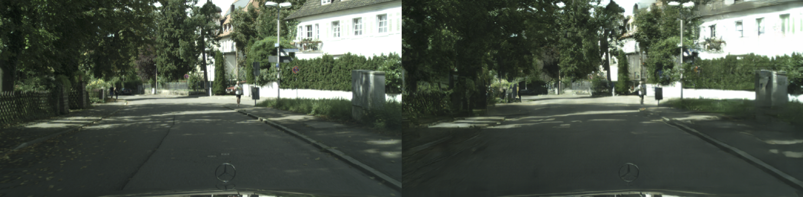
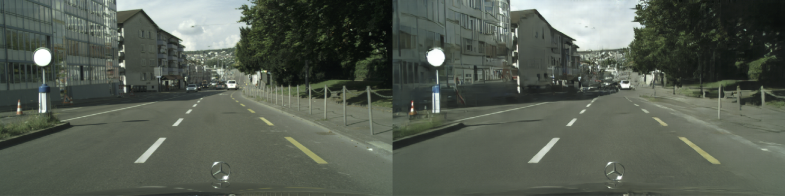
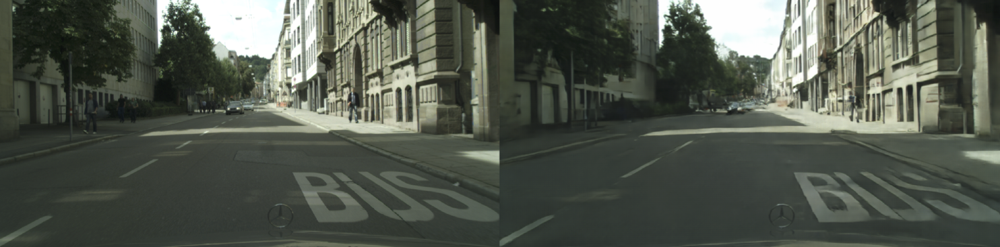
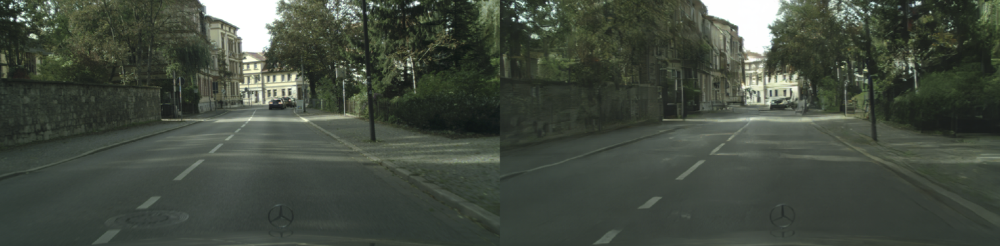
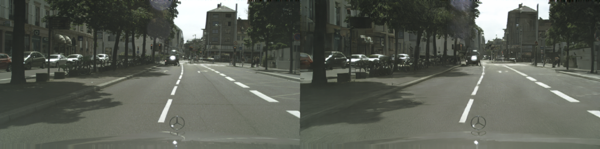
