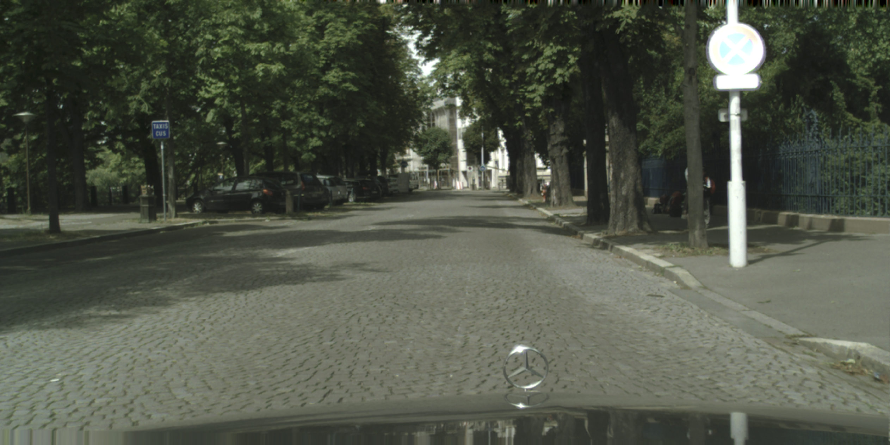
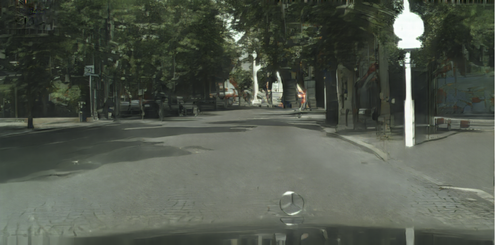
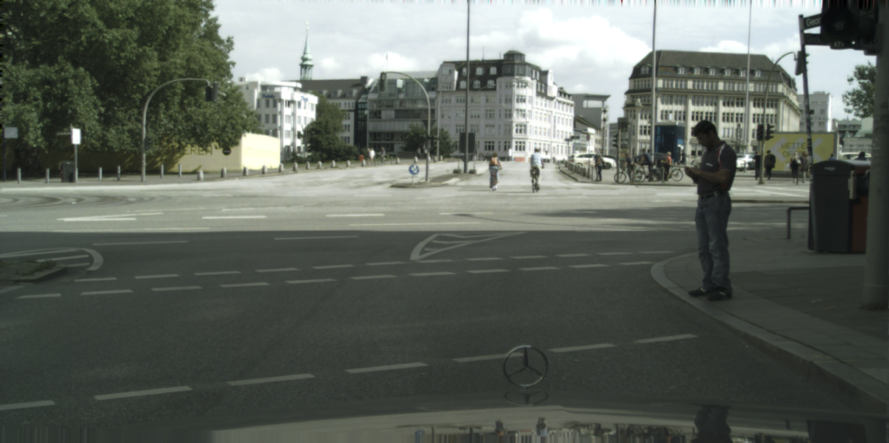
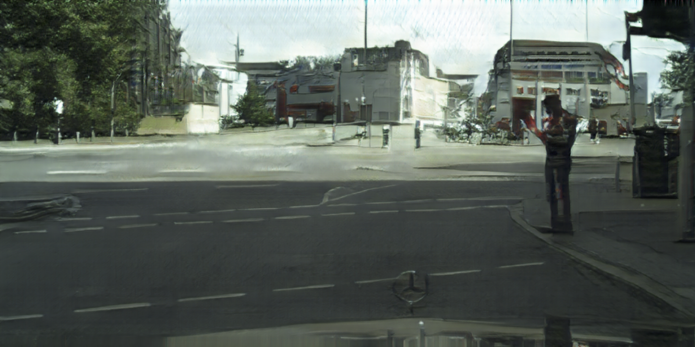
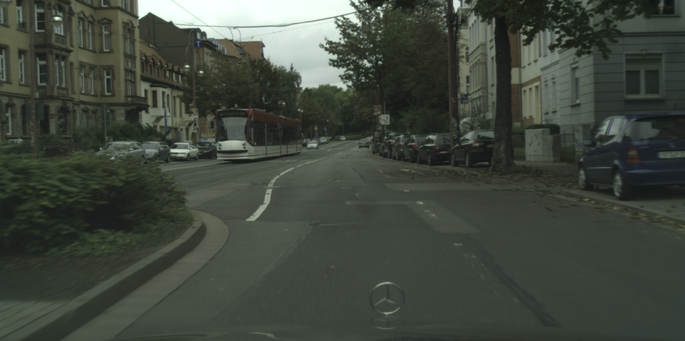
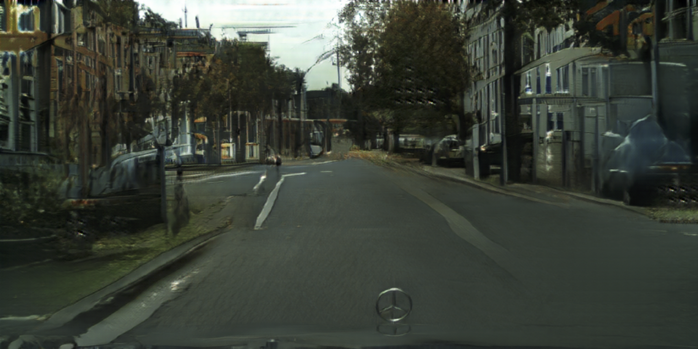

# generative-compression

TensorFlow Implementation for learned compression of images using Generative Adversarial Networks. The method was developed by Agustsson et. al. in [Generative Adversarial Networks for Extreme Learned Image Compression](https://arxiv.org/abs/1804.02958). The proposed idea is very interesting and their approach is well-described.


-----------------------------
## Usage
The code depends on [Tensorflow 1.8](https://github.com/tensorflow/tensorflow)
```bash
# Clone
$ git clone https://github.com/Justin-Tan/generative-compression.git
$ cd generative-compression

# To train, check command line arguments
$ python3 train.py -h
# Run
$ python3 train.py -opt momentum --name my_network
```
Training is conducted with batch size 1 and reconstructed samples / tensorboard summaries will be periodically written every certain number of steps (default is 128). Checkpoints are saved every 10 epochs. 

To compress an image (coming soon).
```bash
# Compress
$ python3 compress.py -h  # check arguments
$ python3 compress.py -i /path/to/image -r /path/to/model/checkpoint
```

## Results
These globally compressed images are from the test split of the Cityscapes `leftImg8bit` dataset. The decoder seems to hallunicate greenery in buildings, and vice-versa. 

#### C=8 channels, multiscale discriminator
| Input | Output (0.072 bpp) |
|-------|-------|
| |  |
| |  |

```
Show quantized C=4,8,16 channels image comparison
```
#### Hallucinations from sampled noise passed through a  DCGAN generator
| Input | Output (0.072 bpp) |
|-------|-------|
| |  |

| Generator Loss | Discriminator Loss |
|-------|-------|
| |  |

## Pretrained Model
You can find pretrained models for global compression with a channel bottleneck of `C = 8` (corresponding to a 0.072 bpp representation) and multiscale discriminator loss under `<dropbox link here>`. The model was trained for 64 epochs on the train split of the [Cityscapes](https://www.cityscapes-dataset.com/) `leftImg8bit` dataset. 
* Warning: Tensorflow 1.3 was used to train the models, but it appears to load without problems on Tensorflow 1.8. 

## Details / extensions
The network architectures are based on the description provided in the appendix of the original paper, which is in turn based on the paper [Perceptual Losses for Real-Time Style Transfer
and Super-Resolution](https://cs.stanford.edu/people/jcjohns/eccv16/) The multiscale discriminator loss used was originally proposed in the project [High-Resolution Image Synthesis and Semantic Manipulation with Conditional GANs](https://tcwang0509.github.io/pix2pixHD/), consult `network.py` for the implementation. If you would like to add an extension you can write a new `@staticmethod` under the `Network` class, e.g.

```python
@staticmethod
def my_generator(z, **kwargs):
    """
    Inputs:
    z: sampled noise

    Returns:
    upsampled image
    """

    return tf.random_normal([z.get_shape()[0], height, width, channels], seed=42)
```
To change hyperparameters/toggle features use the knobs in `config.py`. (Bad form maybe. but I find it easier than a 20-line `argparse` specification).

### Data / Setup
Training was done using the [ADE 20k dataset](http://groups.csail.mit.edu/vision/datasets/ADE20K/) and the [Cityscapes leftImg8bit dataset](https://www.cityscapes-dataset.com/). In the former case images are rescaled to width `512` px, and in the latter images are [resampled to `[512 x 1024]` prior to training](https://www.imagemagick.org/script/command-line-options.php#resample). In each case, you will need to create a Pandas dataframe containing a single column: `path`, which holds the absolute/relative path to the images. This should be saved as a `HDF5` file, and you should provide the path to this under the `directories` class in `config.py`. Examples for the Cityscapes dataset are provided in the `data` directory. 

### Dependencies
* Python 3.6
* [Pandas](https://pandas.pydata.org/)
* [TensorFlow 1.8](https://github.com/tensorflow/tensorflow)

### Todo:
* Incorporate GAN noise sampling into the reconstructed image. The authors state that this step is optional and that the sampled noise is combined with the quantized representation but don't provide further details. Currently the model samples from a normal distribution and upsamples this using a DCGAN-like generator (see `network.py`) to be concatenated with the quantized image representation `w_hat`, but this appears to substantially increase the 'hallunication factor' in the reconstructed images.
* Integrate VGG / feature-matching losses.
* Extend to selective compression using semantic maps (contributions welcome).

### Resources
* [Generative Adversarial Networks for Extreme Learned Image Compression](https://data.vision.ee.ethz.ch/aeirikur/extremecompression/#publication)
* [CycleGAN](https://arxiv.org/pdf/1703.10593.pdf)
* [High-Resolution Image Synthesis and Semantic Manipulation with Conditional GANs](https://tcwang0509.github.io/pix2pixHD/)

